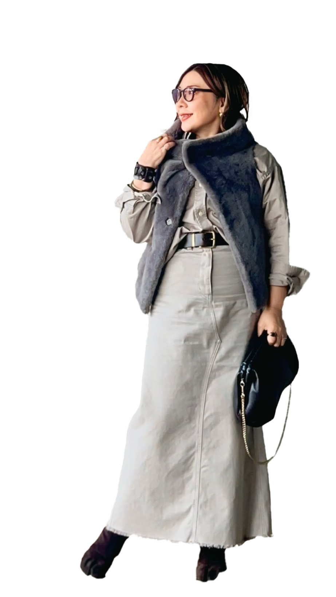

<!DOCTYPE html>
<html lang="ja">
  <head>
    <meta charset="UTF-8" />
    <meta name="viewport" content="width=device-width, initial-scale=1.0" />
    <title>Profile</title>
    <meta name="description" content="" />

    <!-- ファビコン有無確認 -->
    <link rel="icon" href="" />

    <!-- font -->
    <link rel="preconnect" href="https://fonts.googleapis.com" />
    <link rel="preconnect" href="https://fonts.gstatic.com" crossorigin />
    <link
      href="https://fonts.googleapis.com/css2?family=Aboreto&family=Noto+Sans+JP:wght@100..900&family=Noto+Serif+JP:wght@200..900&family=Qwitcher+Grypen:wght@400;700&display=swap"
      rel="stylesheet"
    />

    <!-- SEO関連 -->
    <meta name="description" content="ページの簡単な説明" />
    <!-- キーワード → 現在、あまり重要視されていないですが付けるか確認 -->
    <meta name="keywords" content="キーワード1, キーワード2, キーワード3" />
    <meta name="author" content="作成者名" />

    <!-- css -->
    <link rel="stylesheet" href="./css/reset.css" />
    <link rel="stylesheet" href="./css/base.css" />
    <link rel="stylesheet" href="./css/layout.css" />
    <link rel="stylesheet" href="./css/pages/profile.css" />

    <!-- SNSやOGP対応（オプション） -->
    <meta property="og:title" content="ページタイトル" />
    <meta property="og:description" content="ページの説明" />
    <meta property="og:image" content="og-image.jpg" />
    <meta property="og:url" content="https://example.com" />
    <meta name="twitter:card" content="summary_large_image" />

    <!-- jsファイル -->
  </head>
  <body>
    <!-- header -->
    <header class="header">
      <nav class="header-nav l-container">
        <ul>
          <li class="header-item nav-item"><a href="">ホーム</a></li>
          <li class="header-item nav-item"><a href="">メニュー</a></li>
          <li class="header-item nav-item"><a href="">プロフィール</a></li>
          <li class="header-item nav-item"><a href="">お客様の声</a></li>
          <li class="header-item nav-item"><a href="">お問い合わせ</a></li>
        </ul>
        

          <a class="cta-btn header-btn-link" href="">ご予約はこちら</a>
        

      </nav>
    </header>

    <!-- top -->
    

      

        
      

      <h1 class="page-top-ttl l-container">PROFILE</h1>
    

    <!-- profile コンテンツ -->
    <section class="profile">
      

        <!-- 名前 -->
        

          

            

              

                <h2 class="profile__name">
                  
SAYA

                </h2>
                <h2 class="profile__name">
                  
本名：高橋明香

                </h2>
              

            

          

          

          <!-- 資格 -->
          

            

              <!-- 資格テキスト -->
              

                

                  <h2 class="profile__section-title inverse-txt">保有資格</h2>
                  <ul class="profile__list">
                    <li class="profile__list-item inverse-txt">
                      顔タイプ診断1級アドバイザー
                    </li>
                    <li class="profile__list-item inverse-txt">
                      顔タイプ診断®メンズアドバイザー
                    </li>
                    <li class="profile__list-item inverse-txt">
                      パーソナルカラー診断（Sci/ART 12分類）
                    </li>
                    <li class="profile__list-item inverse-txt">
                      骨格診断アドバイザー
                    </li>
                    <li class="profile__list-item inverse-txt">
                      イメージコントロールメイクアドバイザー
                    </li>
                  </ul>
                

                <!-- タイプ -->
                

                  

                    <h2 class="profile__section-title">診断タイプ</h2>
                    <ul class="profile__list">
                      <li class="profile__list-item">
                        顔タイプ：ソフトエレガント
                      </li>
                      <li class="profile__list-item">
                        パーソナルカラー：ソフトオータム（サイアート12分類）
                      </li>
                      <li class="profile__list-item">骨格診断：ストレート</li>
                      <li class="profile__list-item">
                        （7タイプ：ドラマチックタイプ、12タイプ：メリハリナチュラル）
                      </li>
                    </ul>
                  

                

                <!-- プロフィール画像 -->
                

                  

                    150cm
                    50S
                    
                  

                

              

            

          

        

      

    </section>

    <!-- outfit コンテンツ -->
    <section class="outfit">
      

        

          

            <!-- outfit画像 -->
            

              
outfit

              

                
              

            

            <!-- outfit txt -->
            

              <!-- reason left -->
              

                

                  <h3 class="profile__section-title profile_outfit-ttl">
                    得意なスタイルは キレイめ大人カジュアル
                  </h3>
                

                

                  

                    年齢を重ねていくうちに、カジュアルが似合いづらくなってきたと感じたことはありませんか？大人世代になるとカジュアルを着こなすために、コーディネートで抑えるぽいとがいくつもあります。大人世代でカジュアルがお好きな方はぜひ、私にお任せください。
                  

                

              

              <!-- reason center -->
              

                

                  <h3 class="profile__section-title profile_outfit-ttl">
                    ワントーンコーデでも 地味にならないスタイリング
                  </h3>
                

                

                  

                    顔タイプのソフトエレガントは、得意なテイストがシンプルなワントーンコーデ。同じソフトエレガントの方で、なぜかいつも地味に見えてしまうという悩みを抱えていませんか？同じソフトエレガントだからこそ、ワントーンコーデでも具体的に垢抜けるテクニックをお伝えできます。
                  

                

              

              <!-- reason right -->
              

                

                  <h3 class="profile__section-title profile_outfit-ttl">
                    プロも学びに来る 小物テクニックに自信あり
                  </h3>
                

                

                  

                    顔タイプのソフトエレガントは、得意なテイストがシンプルなワントーンコーデ。同じソフトエレガントの方で、なぜかいつも地味に見えてしまうという悩みを抱えていませんか？同じソフトエレガントだからこそ、ワントーンコーデでも具体的に垢抜けるテクニックをお伝えできます。
                  

                

              

            

          

        

      

    </section>

    <!-- 実績コンテンツ -->
    <section class="experience">
      

        

          

            <!-- 実績画像 -->
            

              

                
              

            

            <!-- 実績txt -->
            

              

                <!-- 企業実績 -->
                

                  <h2 class="profile__section-title">企業研修</h2>
                  <ul class="profile__list">
                    <li class="profile__list-item">TDK株式会社 様</li>
                    <li class="profile__list-item">
                      株式会社トゥモローランド 様
                    </li>
                    <li class="profile__list-item">
                      その他 大手電機会社などで診断・スタイリング指導を担当
                    </li>
                    <li class="profile__list-item">
                      大学や企業内定者向け研修の講師アシスタントとしても参加
                    </li>
                  </ul>
                

                <!-- イベント -->
                

                  

                    <h2 class="profile__section-title">イベント出演・監修</h2>
                    <ul class="profile__list">
                      <li class="profile__list-item">銀座三越 様</li>
                      <li class="profile__list-item">
                        ニッケコルトンプラザ 様
                      </li>
                      <li class="profile__list-item">
                        s-pal仙台 様などの商業施設
                      </li>
                      <li class="profile__list-item">コスメウィーク</li>
                      <li class="profile__list-item">
                        JAPANドラッグストアショーなどの大型イベント
                      </li>
                      <li class="profile__list-item">
                        和洋女子大学のオープンキャンパスなどの学生イベント
                      </li>
                    </ul>
                  

                

                <!-- メディア -->
                

                  

                    <h2 class="profile__section-title">メディア出演</h2>
                    <ul class="profile__list">
                      <li class="profile__list-item">
                        顔タイプ診断&reg;公式Youtubeチャンネルに出演 各企画のスタイリストとして継続的に参加
                      </li>
                       
                      <li class="profile__list-item">
                        コスメヲタクちゃんねる サラ様のYoutubeを企画、 
                        骨格診断のスタイリング担当として出演
                      </li>
                    </ul>
                  

                

              

            

          

        

      

    </section>

    <!-- Q&A -->
    <section class="outfit">
      

        

          

            <!-- qa項目 -->
            <!-- top -->
            

              <ul class="profile__qa-list">
                <li class="profile__qa-list-item">
                  
Q1 家族構成は？

                  
夫、息子2人の4人家族です。

                </li>
                <li class="profile__qa-list-item">
                  
Q2 好きな雑誌は？

                  
Marisol・Vintaine

                </li>
              </ul>
              <!-- middle -->
              <ul class="profile__qa-list">
                <li class="profile__qa-list-item">
                  
Q3 好きな色は？

                  
グレージュ・白・ブラウン

                </li>
                <li class="profile__qa-list-item">
                  
Q4 好きなスタイルは？

                  
ミラノマダム・ミラネーゼ

                </li>
              </ul>
              <!-- bottom -->
              <ul class="profile__qa-list">
                <li class="profile__qa-list-item">
                  
Q5 昔の職業は？

                  

                    電話のコミュニケーターや、銀行事務の仕事をしていました。
                  

                </li>
                <li class="profile__qa-list-item">
                  
Q6 好きなブランドは？

                  

                    Whim Gazette、1er
                    Arrondissement、ユナイテッドアローズ、Deuxiem
                    Classe、GALLARDA GALANTE、Maison de R
                  

                </li>
                <li class="profile__qa-list-item">
                  
Q7 お客様に一言

                  

                    「好き」を大事におしゃれを楽しむ方法をご提案します。ぜひ一緒におしゃれを楽しみましょう。
                  

                </li>
              </ul>
            

            <!-- 画像 -->
            

              <h3 class="profile__qa-img-ttl">Q&A</h3>
              

                
              

            

          

        

      

    </section>

    <!-- 以下、前ページ共通 -->
    <!-- reserve -->
    

      <section class="reserve__btn">
        

          

            
あなたの毎日を輝かせるためのおしゃれを見つけましょう

          

          

            <a class="reserve__btn-footer cta-btn" href="">ご予約はこちら</a>
          

        

      </section>
    

    <!-- footer -->
    <footer class="footer">
      

        <nav class="footer__nav">
          <ul>
            <li class="footer__item nav-item"><a href="">ホーム</a></li>
            <li class="footer__item nav-item"><a href="">メニュー</a></li>
            <li class="footer__item nav-item"><a href="">プロフィール</a></li>
            <li class="footer__item nav-item"><a href="">お客様の声</a></li>
            <li class="footer__item nav-item"><a href="">お問い合わせ</a></li>
            <li class="footer__item nav-item">
              <a class="footer__nav-sns-link" href="">Instagram </a>
            </li>
          </ul>
          

              
          

        </nav>
      

      

        
©2024 porta fortuna プライバシーポリシー

      

    </footer>
  </body>
</html>
